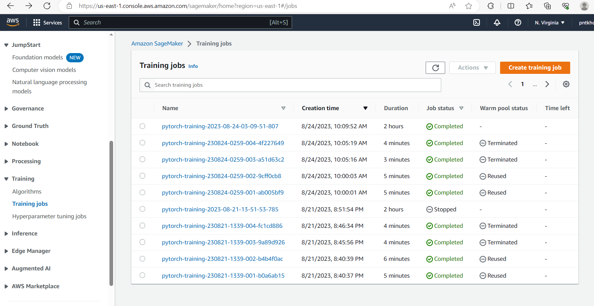

# Image Classification using AWS SageMaker

Use AWS Sagemaker to train a pretrained model that can perform image classification by using the Sagemaker profiling, debugger, hyperparameter tuning and other good ML engineering practices. This can be done on either the provided dog breed classication data set or one of your choice.
Please find below for the overview of the project:

## Project Set Up and Installation
Enter AWS through the gateway in the course and open SageMaker Studio. 
Download the starter files.
Download/Make the dataset available. 

## Dataset
The provided dataset is the dogbreed classification dataset which can be found [here](https://s3-us-west-1.amazonaws.com/udacity-aind/dog-project/dogImages.zip).
The project is designed to be dataset independent so if there is a dataset that is more interesting or relevant to your work, you are welcome to use it to complete the project.

### Access
Upload the data to an S3 bucket through the AWS Gateway so that SageMaker has access to the data. 

## Hyperparameter Tuning
We are going to utilize the pre-trained model called Resnet50 and with training and tunning model with learning rate, epochs and batch sizes. 
- learning rate: The learning rate is a hyperparameter that determines the step size at each iteration while updating the weights of a machine learning model during training. It controls how quickly or slowly the model learns from the data. A high learning rate can cause the model to converge quickly, but it may also result in overshooting the optimal solution and lead to instability. On the other hand, a low learning rate may cause the model to converge slowly or get stuck in a suboptimal solution. It's important to choose an appropriate learning rate to ensure efficient and effective model training.
- batch size: The batch size is another hyperparameter in machine learning that determines the number of samples or data points that are used in each iteration of training. During training, the data is divided into smaller subsets or batches, and the model updates its weights based on the average gradient computed from each batch. The batch size can have an impact on the training process and the model's performance. A larger batch size can lead to faster training because more samples are processed in parallel, but it also requires more memory. It can also result in a less noisy estimate of the gradient, which can be beneficial for stable convergence. On the other hand, a smaller batch size requires less memory and allows for more frequent weight updates, which can help the model converge faster. However, it can also introduce more noise into the gradient estimate, which may make the training process less stable. Choosing an appropriate batch size depends on various factors, such as the available computational resources, the size of the dataset, and the complexity of the model. It often involves a trade-off between training speed and model performance.
- epoch: epoch refers to a complete pass or iteration through the entire training dataset during the training process. During each epoch, the model goes through all the training samples and updates its weights based on the computed gradients. To understand the concept of an epoch, let's consider an example. Suppose we have a dataset of 1000 images and we set the batch size to 100. In this case, it would take 10 iterations or batches to cover the entire dataset. If we train the model for 5 epochs, it means that the model will go through the entire dataset 5 times, with each epoch consisting of 10 iterations. The number of epochs is a hyperparameter that determines how many times the model will be trained on the entire dataset. It is important to find the right balance when choosing the number of epochs. Training for too few epochs may result in underfitting, where the model fails to capture the underlying patterns in the data. On the other hand, training for too many epochs may lead to overfitting, where the model becomes too specialized to the training data and performs poorly on unseen data. To determine the optimal number of epochs, it is common to monitor the model's performance on a separate validation dataset and stop training when the performance stops improving or starts to degrade. 

+ hyperparameter_ranges: 
    - learning rate (0.001, 0.1)
    - batch size: 16, 32, 64
    - epochs: (2, 6)
    
+ The best hyperparameters:
    - learning rate: 0.0011532892435787902
    - batch size: 64
    - epochs: 6

## Debugging and Profiling
Using the best hyperparameters as mentioned above, we create and finetune a new model and make a summary report on debugging and profiling.

The following table shows a profiling summary of the Debugger built-in rules. The table is sorted by the rules that triggered the most frequently. During your training job, the GPUMemoryIncrease rule was the most frequently triggered. It processed 0 datapoints and was triggered 0 times.

## Model Deployment
We successfully deployed the model endpoint as below screenshot. And utilize the endpoint to make a test prediction on beagle's breed in folder. We managed to make right 5 over 8 images in the notebook. Absouletely there is a room to improve the model accuracy on this dog's breed specificially. 

- Successfully model trained

- Here is the model artifacts stored in S3

- Model endpoint

